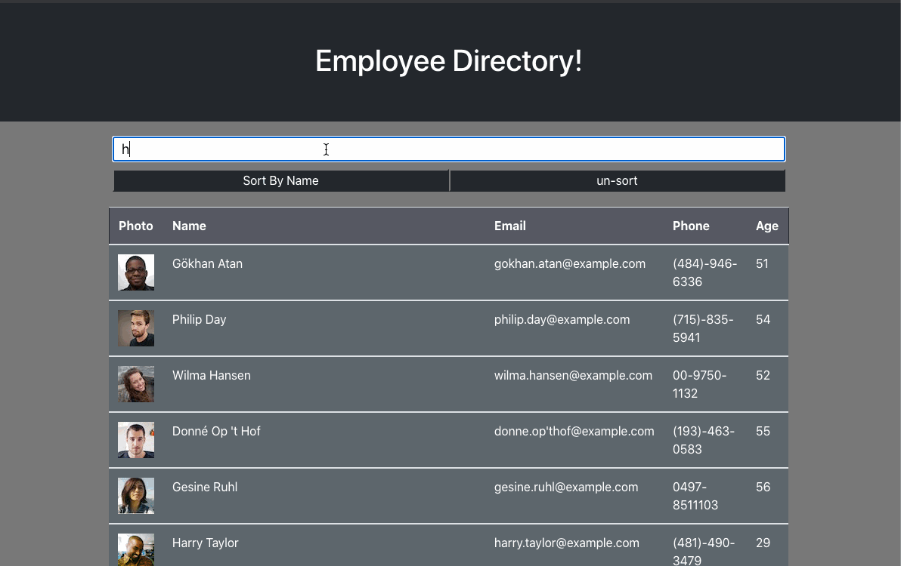

# Employee Tracker


## Table of Contents
* [Description](#Description)
* [Technologies](#Technologies)
* [Features](#Features)
* [Code](#Code)
* [Author](#Author)
* [Credits](#Credits)
* [License](#License)

## Description 
Hi Welcome to my Employee Directory app. Here you will see a set of 20 emplyees with both abilities to search for them just by typing into the imput field, as well as sorting them by name. This app while being made with different technologies it primarly has react js!


## Technologies
* [JavaScript](https://www.w3schools.com/js/)
* [Bootstrap](https://getbootstrap.com/)
* [React](https://reactjs.org/)
* [ReactDom](https://reactjs.org/docs/react-dom.html)


## Features


# Code

## Using setState

*  Here I am using setState to filter through the array of employees and compare them to the target value. I pass this to my onChange hook and anytime the user types a letter into the imput field the function will be called which will rerender the page with a new set of employees.
```
 const handleInputChange = (event) => {
    const { value } = event.target;
    const filtered = Employees.filter(
      (employee) =>
        employee.name.first.toLowerCase().includes(value.toLowerCase()) ||
        employee.name.last.toLowerCase().includes(value.toLowerCase())
    );
    setInputState(value);
    setEmployeesState(filtered);
    // console.log("sorter: " + JSON.stringify(employeesState))
  };


  ```

## Using Provider and props
* Here I am passing a value to my provider of employeeState which contains all the imployee information that we need, then it passes those values to it's children ie the TableHeader which container my rows of employees. 

```
  return (
    <div className="con">
      <Jumbo />
      {/* <Search nameInput={inputState} handleInputChange={handleInputChange} /> */}
      <EmployeeContext.Provider value={employeesState}>
        <div className="container">
        <Search nameInput={inputState} handleInputChange={handleInputChange} handleSort={handleSort} unSort={unSort}/>
        <TableHeader/>
        </div>
      </EmployeeContext.Provider>
    </div>
  );
}

```


## Author
Ivan Torres
* [GitHub-Repo](https://github.com/IvanTorresMia/Employee-Directory-itorres/tree/main/employee-directory-itorres)
* [linkedIn](www.linkedin.com/in/ivan-torres-0828931b2)
* [Portfolio](https://ivantorresmia.github.io/IvanTorres-portfolio/)
* [Deployed-Link](https://ivantorresmia.github.io/Employee-Directory-itorres/)

## Credits
* Credits for this homework assignment go out to Jerome, Manuel, Kerwin, Roger, and all of my classmates who helped me in study sessions. As well as my tutor who helped me a ton with understanding this homework assignment. 
* [StackOverFlow](https://stackoverflow.com/)


## License]
[MIT](https://choosealicense.com/licenses/mit/#) license 